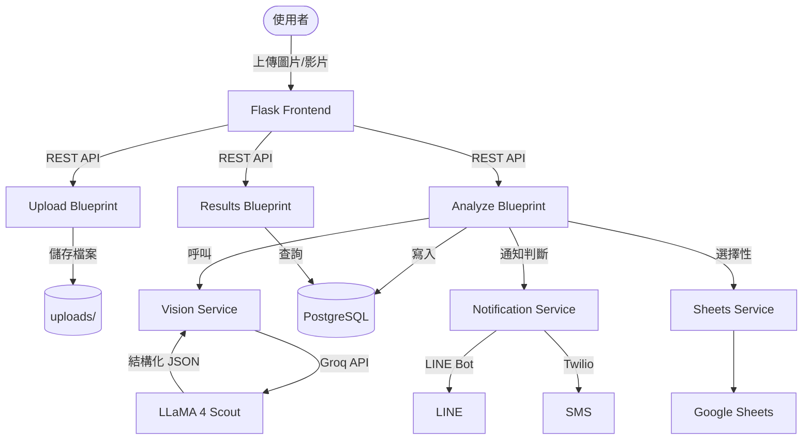

# 🛡️ Fall Detection AI — 老人跌倒偵測系統

基於 **Flask + Groq Vision + PostgreSQL** 的老人跌倒偵測系統。上傳街景照片，AI 自動判斷畫面中是否有人跌倒，並透過 LINE / SMS 即時通知。

## Architecture



## 專案結構

```
├── app/
│   ├── __init__.py          # App Factory (create_app)
│   ├── config.py            # .env 設定讀取
│   ├── extensions.py        # SQLAlchemy / Migrate
│   ├── models.py            # FallEvent ORM
│   ├── api/
│   │   ├── upload.py        # 圖片/影片上傳 + 拆幀
│   │   ├── analyze.py       # 跌倒偵測分析
│   │   └── results.py       # 查詢/匯出/清除/health
│   └── services/
│       ├── vision.py        # Groq Vision 呼叫
│       ├── notification.py  # LINE + SMS + 去重
│       └── sheets.py        # Google Sheets 同步
├── templates/index.html     # 前端 UI
├── uploads/                 # 上傳檔案
├── .env / .env.example      # 環境變數
├── requirements.txt
├── run.py                   # 啟動入口
├── Dockerfile
├── docker-compose.yml
└── README.md
```

## 快速開始

### 1. 安裝依賴

```bash
pip install -r requirements.txt
```

### 2. 設定環境變數

```bash
cp .env.example .env
# 編輯 .env，填入 GROQ_API_KEY 和 DB 設定
```

### 3. 建立 PostgreSQL 資料庫

```bash
# 確保 PostgreSQL 已啟動
createdb fall_detection
```

### 4. 初始化資料庫

```bash
flask --app run:app db init
flask --app run:app db migrate -m "initial"
flask --app run:app db upgrade
```

### 5. 啟動

```bash
python run.py
# 打開瀏覽器 http://localhost:5000
```

## Docker 部署

```bash
docker-compose up -d --build
# 初始化 DB migration
docker-compose exec web flask db init
docker-compose exec web flask db migrate -m "initial"
docker-compose exec web flask db upgrade
```

## API Endpoints

| Method | Path             | 說明               |
| ------ | ---------------- | ------------------ |
| GET    | `/`              | 前端頁面           |
| POST   | `/api/upload`    | 上傳圖片/影片      |
| POST   | `/api/analyze`   | 啟動跌倒偵測分析   |
| GET    | `/api/status`    | 查詢處理進度       |
| GET    | `/api/results`   | 取得辨識結果       |
| GET    | `/api/events`    | 分頁查詢事件       |
| GET    | `/api/export-csv`| 匯出 CSV           |
| POST   | `/api/clear`     | 清除所有資料       |
| GET    | `/api/health`    | 健康檢查           |

## 技術棧

- **Backend**: Flask (App Factory + Blueprints)
- **Database**: PostgreSQL + SQLAlchemy + Flask-Migrate
- **AI Model**: Groq API — LLaMA 4 Scout 17B (Vision)
- **Notification**: LINE Bot SDK + Twilio SMS
- **Export**: Google Sheets API + CSV
- **Deploy**: Docker + Gunicorn